# Cleck Cloud

> A full-stack, multi-vendor e-commerce marketplace connecting customers, independent traders and administrators through dedicated commerce, seller-management and Oracle APEX platforms.


---

## Overview

**Cleck Cloud** is a full-stack, multi-vendor e-commerce ecosystem designed to connect customers with independent local traders through a single marketplace.

Unlike a conventional single-store e-commerce website, Cleck Cloud was designed around a **multi-role architecture** with dedicated experiences for **Customers, Traders and Administrators**.

Customers can browse and filter products, inspect detailed product information and reviews, manage wishlists and shopping carts, complete checkout through collection scheduling and PayPal, receive invoices, review previous orders and manage their accounts.

Traders operate through a dedicated seller platform that supports business registration, email verification, administrator approval, shop management, product and inventory management, order monitoring and account administration. A separate **Oracle APEX Trader Portal** provides analytics, master-detail views, calendars and operational reports.

Administrators use an **Oracle APEX management platform** to oversee traders, shops, customers, products, orders, payments and reviews while accessing dashboards, relationship views, calendars and periodic reports.

The result is an end-to-end marketplace workflow:

**Customer Discovery → Cart → Checkout → Collection Scheduling → Payment → Invoice → Trader Fulfilment → Administrative Oversight**

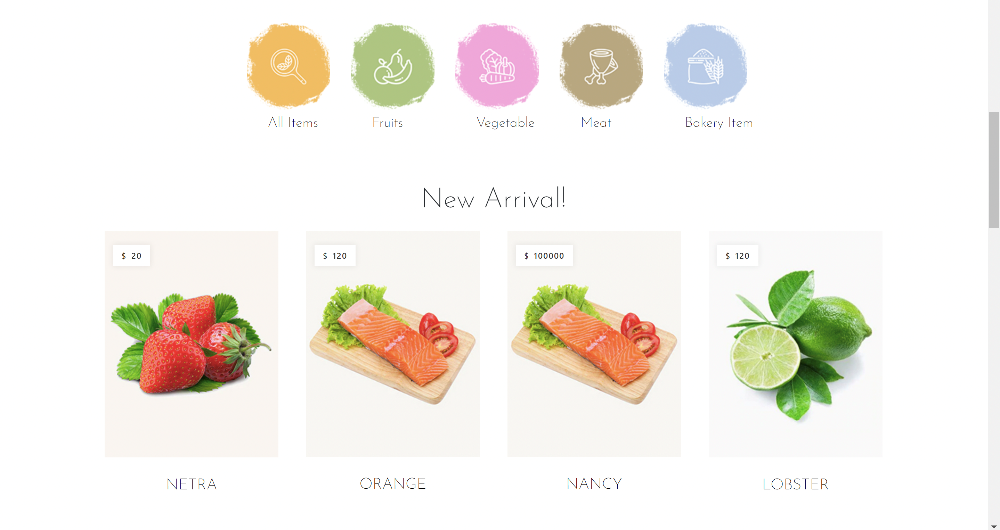

---

## System at a Glance

| Platform | Primary Responsibility | Major Capabilities |
|---|---|---|
| **👤 Customer Platform** | Customer-facing commerce | Product discovery, filtering, details, ratings, reviews, wishlist, cart, checkout, collection scheduling, PayPal, invoices, profile and order management |
| **🏪 Trader PHP Platform** | Seller operations | Trader onboarding, email verification, admin approval, shop management, product management, inventory, orders and account management |
| **📊 Trader Oracle APEX** | Seller analytics and reporting | Dashboard analytics, master-detail views, reviews, order reports, calendars and periodic reporting |
| **🛡️ Admin Oracle APEX** | Marketplace oversight | Traders, shops, customers, products, orders, payments, reviews, analytics, calendars, reporting and role-based administration |

### High-Level Architecture

```text
                         CLECK CLOUD
                              │
            ┌─────────────────┼─────────────────┐
            │                 │                 │
            ▼                 ▼                 ▼
       👤 CUSTOMER        🏪 TRADER        🛡️ ADMIN
        PLATFORM           PLATFORM          PLATFORM
            │                 │                 │
            │                 ├── PHP Dashboard│
            │                 │                 │
            │                 └── Oracle APEX   └── Oracle APEX
            │
            └──────────────┬──────────────────┘
                           │
                           ▼
                    ORACLE DATABASE
                           │
        ┌──────────────────┼──────────────────┐
        ▼                  ▼                  ▼
     Products           Orders             Users
     Shops              Payments           Reviews
     Categories         Collection         Wishlists
     Inventory          Slots              Carts
```

### Table of Contents

- [Customer Platform](#-customer-platform)
- [Trader PHP Platform](#-trader-php-platform)
- [Trader Oracle APEX Portal](#-trader-oracle-apex-portal)
- [Admin & Management Platform](#-admin--management-platform)
- [End-to-End Commerce Workflow](#-end-to-end-commerce-workflow)
- [System Architecture](#-system-architecture)
- [Database Design](#-database-design)
- [Validation, Access Control & Business Rules](#-validation-access-control--business-rules)
- [Testing](#-testing)
- [Technology Stack](#-technology-stack)
- [Project Context](#-project-context)
- [Future Improvements](#-future-improvements)

---

# 👤 Customer Platform

The customer-facing platform provides the complete marketplace experience, from account creation and product discovery through checkout, payment, invoicing and post-purchase account management.

## Account Registration & Authentication

Customers can create an account through a validated registration process.

The registration flow includes:

- Required-field validation
- Email-format validation
- Duplicate-account detection
- Password and confirmation validation
- Terms-and-conditions validation
- Email verification and account activation
- Customer login and logout
- Invalid-credential handling
- Password reset/change flows

<table>
<tr>
<td width="50%" align="center"><strong>Customer Registration</strong></td>
<td width="50%" align="center"><strong>Email Verification</strong></td>
</tr>
<tr>
<td>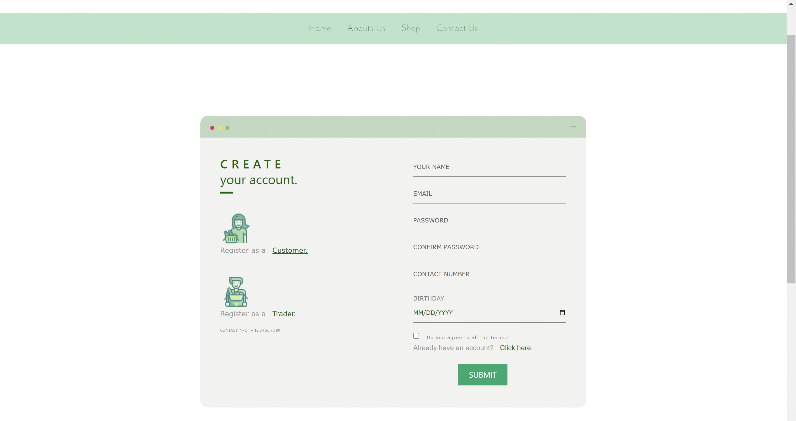</td>
<td>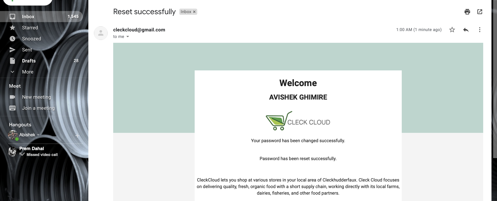</td>
</tr>
</table>

The email-verification step prevents an account from being treated as fully active immediately after form submission and adds an additional stage to the customer onboarding workflow.

---

## Product Discovery & Filtering

Customers can browse the marketplace and narrow the catalogue using multiple filtering dimensions.

Supported product-discovery features include:

- Product catalogue browsing
- Category filtering
- Trader/shop filtering
- Price filtering
- Rating filtering
- Product search
- Product images and pricing
- Stock/availability information
- No-result handling

<table>
<tr>
<td width="50%" align="center"><strong>Category Filter</strong></td>
<td width="50%" align="center"><strong>Shop Filter</strong></td>
</tr>
<tr>
<td>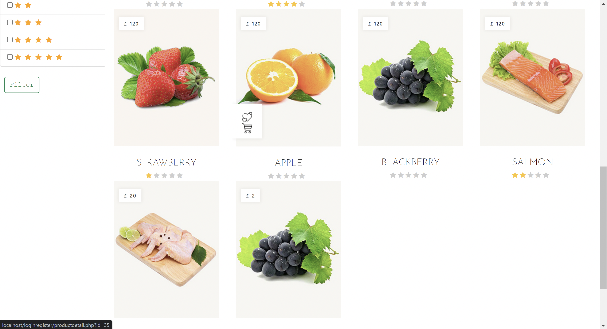</td>
<td>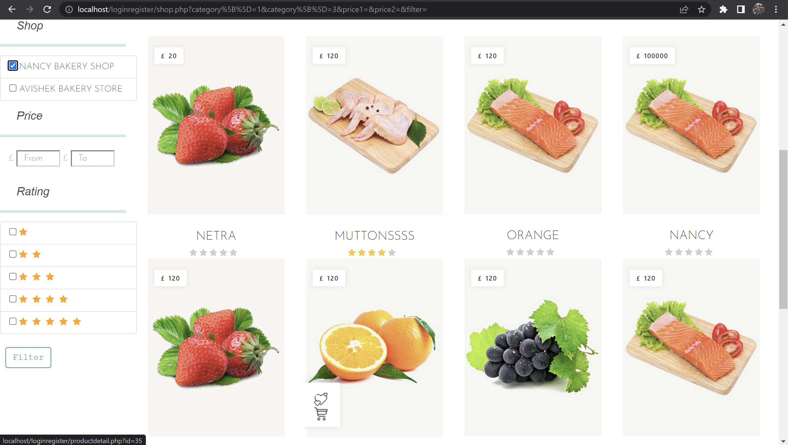</td>
</tr>
<tr>
<td width="50%" align="center"><strong>Price Filter</strong></td>
<td width="50%" align="center"><strong>Rating Filter</strong></td>
</tr>
<tr>
<td>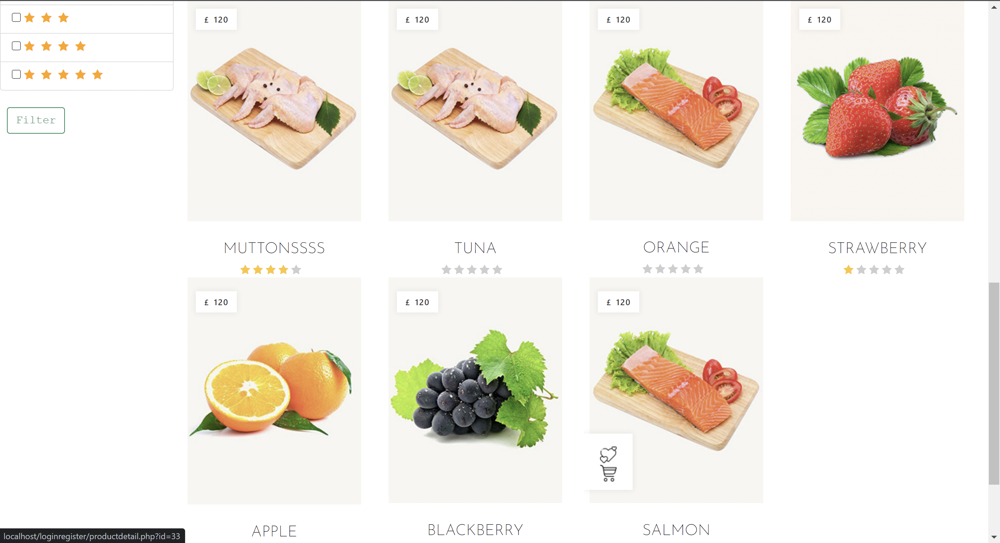</td>
<td>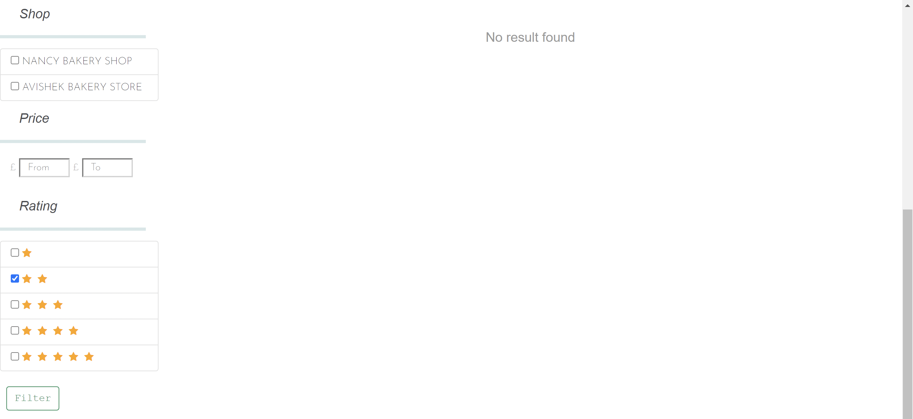</td>
</tr>
</table>

These filters allow customers to move through a multi-vendor catalogue without relying on a single browsing path.

---

## Product Details, Ratings & Reviews

Each product has a dedicated detail experience containing the information required before purchase.

Product-level functionality includes:

- Detailed product information
- Product price
- Stock and availability
- Quantity constraints
- Shop/trader context
- Ratings
- Customer reviews
- Review submission
- Purchase-aware review validation

<table>
<tr>
<td width="50%" align="center"><strong>Product Details</strong></td>
<td width="50%" align="center"><strong>Ratings & Reviews</strong></td>
</tr>
<tr>
<td>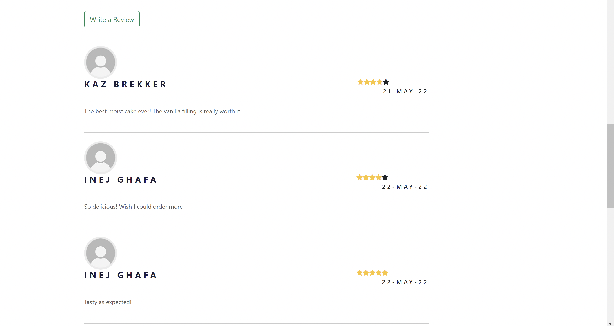</td>
<td>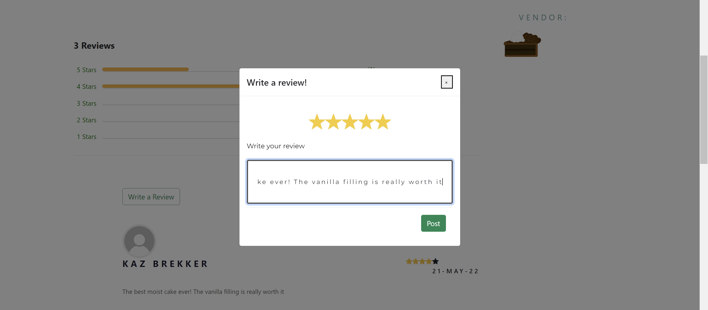</td>
</tr>
</table>

The review workflow includes business rules that prevent unrestricted review submission, including checks around authentication and purchase eligibility.

---

## Wishlist & Shopping Cart

Customers can save products for later through a wishlist and maintain an active shopping cart for checkout.

### Wishlist

Customers can:

- Add products to the wishlist
- View saved products
- Remove products from the wishlist
- Return to saved products later in the shopping journey

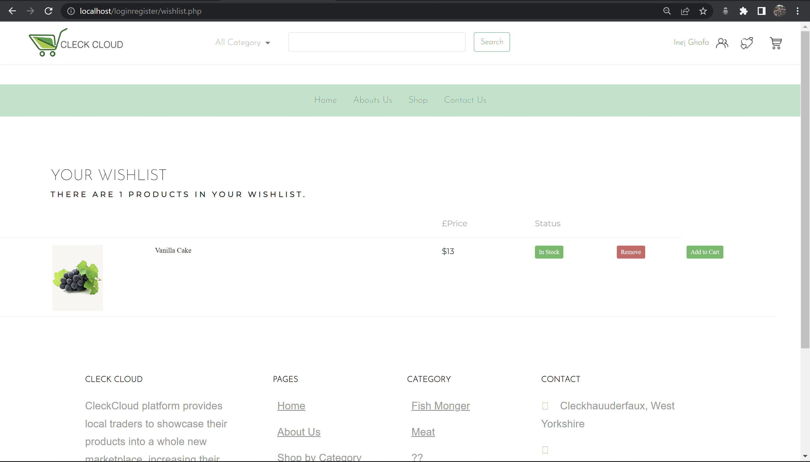

### Shopping Cart

The cart supports:

- Adding products
- Removing products
- Updating quantity
- Product-level minimum quantity
- Product-level maximum quantity
- Available-stock validation
- Overall order quantity rules
- Price and quantity summaries
- Cart total calculation

<table>
<tr>
<td width="50%" align="center"><strong>Shopping Cart</strong></td>
<td width="50%" align="center"><strong>Business-Rule Validation</strong></td>
</tr>
<tr>
<td>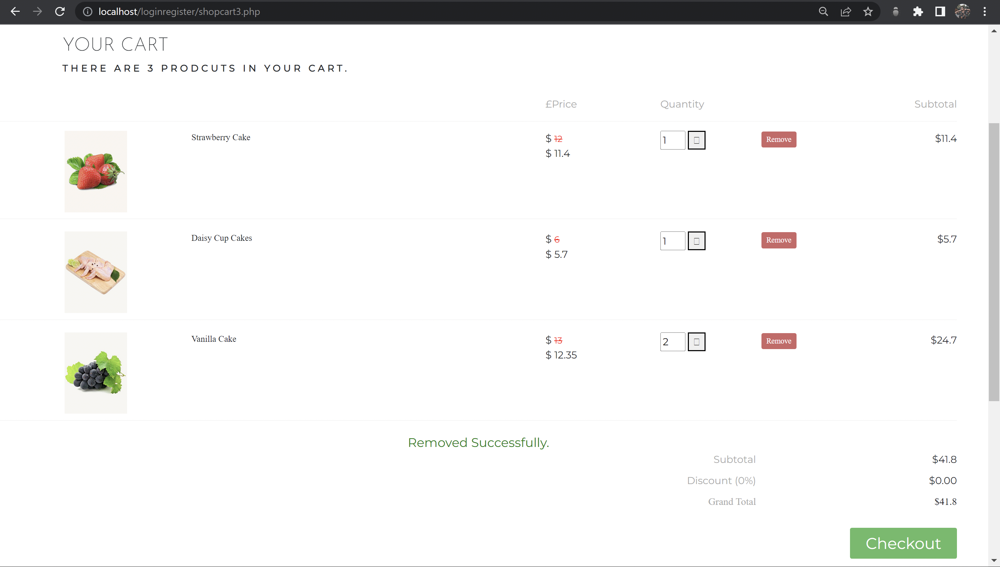</td>
<td>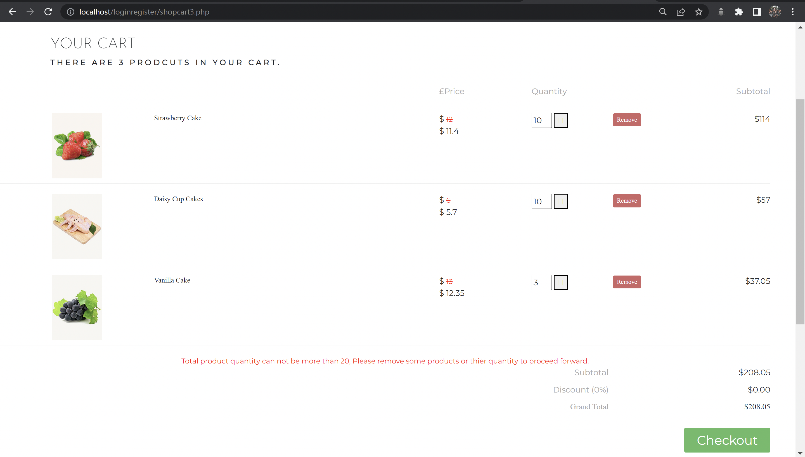</td>
</tr>
</table>

The cart therefore acts as more than a simple list of products: quantity and stock rules are validated before customers proceed through the purchase flow.

---

## Checkout & Collection Scheduling

Cleck Cloud uses a collection-based fulfilment workflow.

During checkout, customers can review the order and choose an available collection day and collection time slot.

<table>
<tr>
<td width="50%" align="center"><strong>Collection Day</strong></td>
<td width="50%" align="center"><strong>Collection Time Slot</strong></td>
</tr>
<tr>
<td>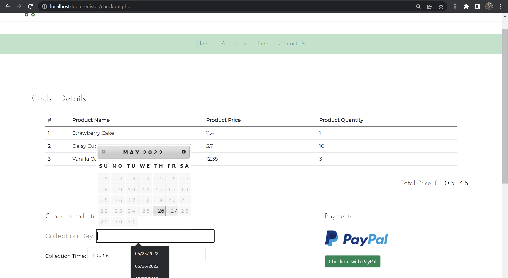</td>
<td>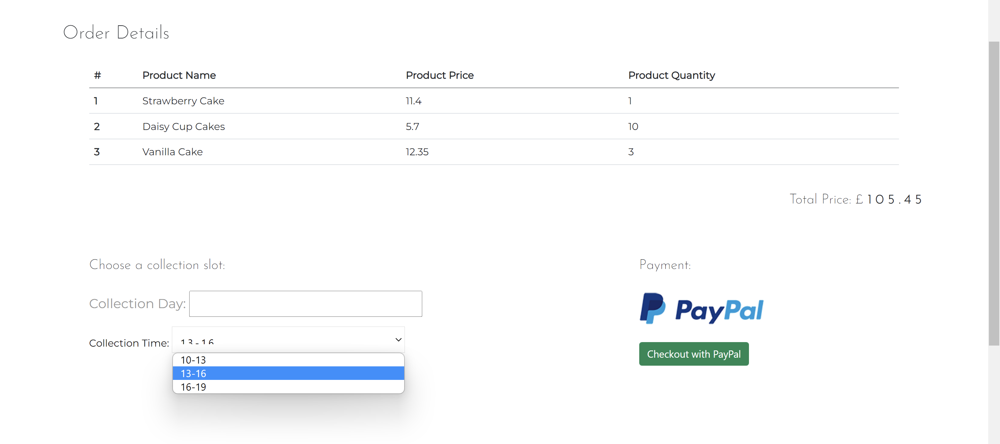</td>
</tr>
</table>

The selected collection information becomes part of the order and is subsequently visible within trader/admin order-management workflows.

---

## PayPal Payment & Order Completion

Cleck Cloud integrates **PayPal** into the checkout flow.

The payment journey includes:

- Checkout hand-off to PayPal
- PayPal authentication/payment flow
- Payment-success handling
- Order creation after successful payment
- Payment/order information retained for later management

<table>
<tr>
<td width="50%" align="center"><strong>PayPal Checkout</strong></td>
<td width="50%" align="center"><strong>Payment Completed</strong></td>
</tr>
<tr>
<td>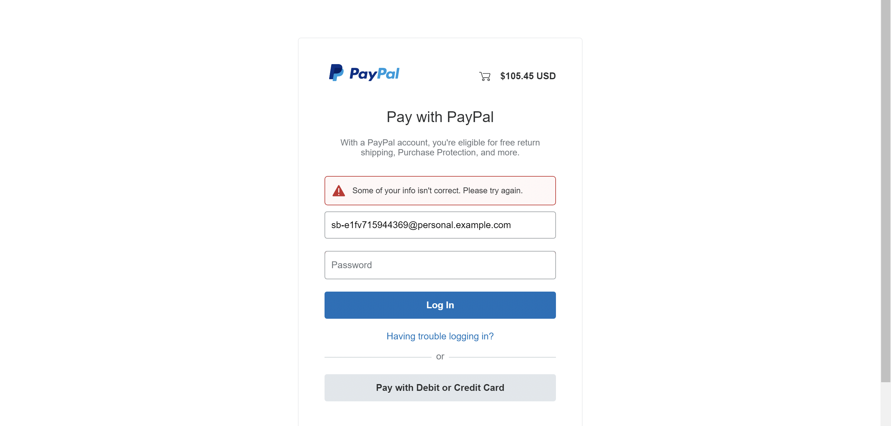</td>
<td>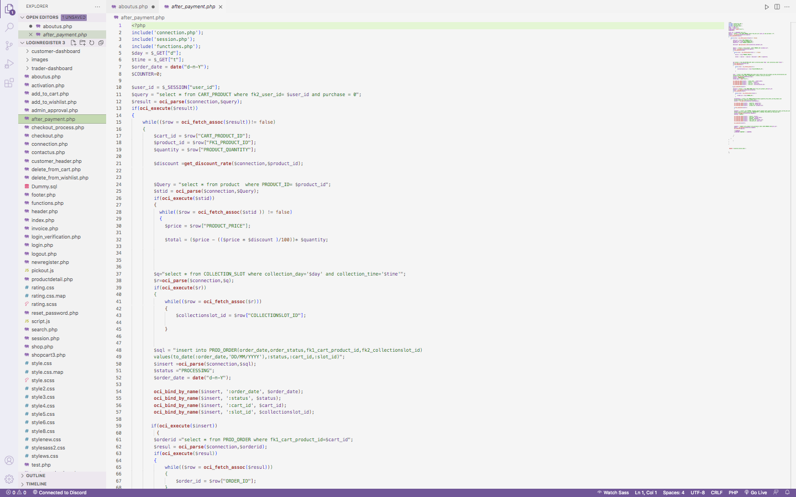</td>
</tr>
</table>

---

## Invoice Generation & Delivery

After a completed order, Cleck Cloud generates an invoice containing the relevant transaction and order information.

Customers can:

- View the generated invoice
- Download the invoice
- Receive invoice/order information by email

<table>
<tr>
<td width="50%" align="center"><strong>Generated Invoice</strong></td>
<td width="50%" align="center"><strong>Invoice Email</strong></td>
</tr>
<tr>
<td>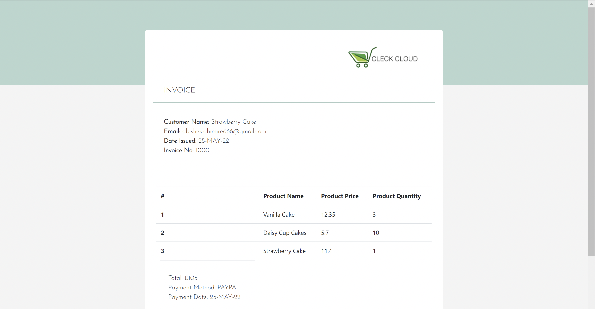</td>
<td>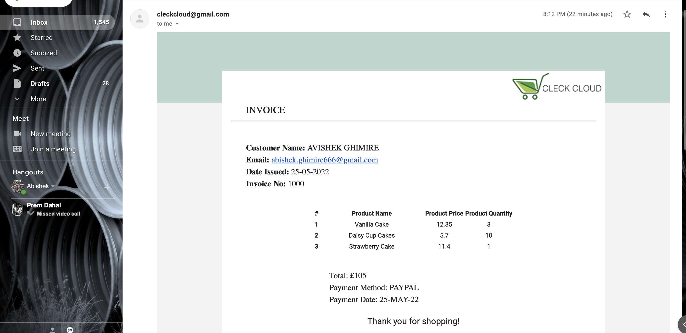</td>
</tr>
</table>

This completes the full customer commerce journey from discovery to post-payment documentation.

---

## Customer Account Management

The customer account area provides access to personal and marketplace information.

Customers can manage:

- Personal details
- Profile image
- Email address
- Password
- Order history
- Wishlist
- Cart
- Account-related information

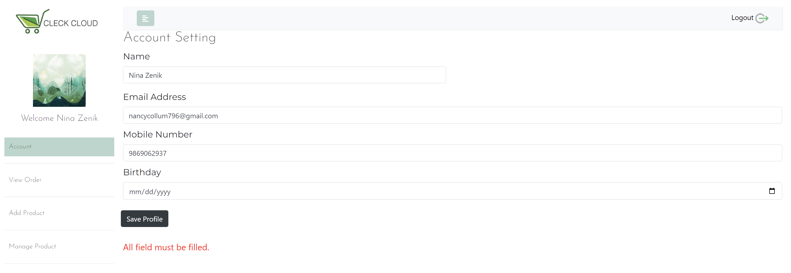

Account updates include validation such as duplicate-email checking, email confirmation and supported-image handling.

---

# 🏪 Trader PHP Platform

The Trader platform turns Cleck Cloud from a single-store shop into a **multi-vendor marketplace**.

Traders can register their businesses, obtain administrator approval, manage shops, manage products and stock, view orders and maintain their accounts.

## Trader Registration & Approval

Trader onboarding is intentionally more complex than customer registration because a trader represents a business operating within the marketplace.

The onboarding workflow includes:

- Trader personal/account information
- Business/shop information
- Required-field validation
- Email validation
- Password validation
- Duplicate trader-email detection
- Duplicate shop-name detection
- Duplicate business-registration-number validation
- Terms-and-conditions validation
- Email verification
- Administrator approval
- Pending status before approval
- Account activation after approval

### 1. Trader Registration

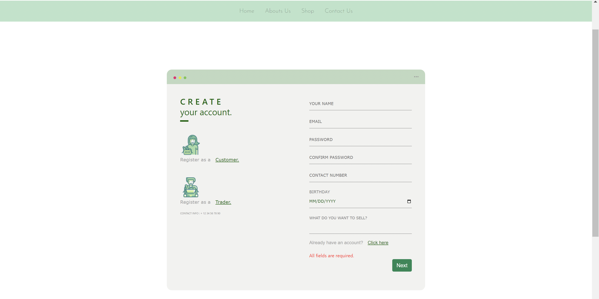

### 2. Email Verification


### 3. Administrator Approval

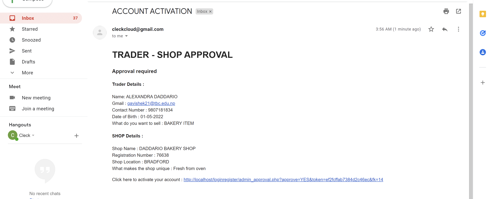

This creates a controlled seller-onboarding process rather than allowing any newly submitted trader account to immediately publish products.

---

## Trader Dashboard

Approved traders receive access to a dedicated dashboard.

The dashboard provides access to:

- Trader account information
- Shop management
- Product management
- Orders
- Profile/account management
- Operational marketplace functions

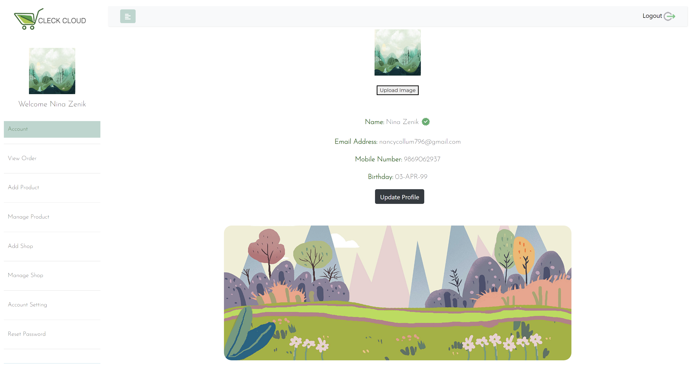

---

## Product Management

Traders can manage the product catalogue belonging to their shops.

The product-management workflow supports:

- Add product
- Required-field validation
- Product image
- Product description
- Price
- Stock quantity
- Quantity constraints
- Duplicate-product validation
- View managed products
- Update product
- Delete product
- Activate/deactivate product
- Product availability/status management
- Product review/rating visibility

<table>
<tr>
<td width="50%" align="center"><strong>Add Product</strong></td>
<td width="50%" align="center"><strong>Manage Products</strong></td>
</tr>
<tr>
<td>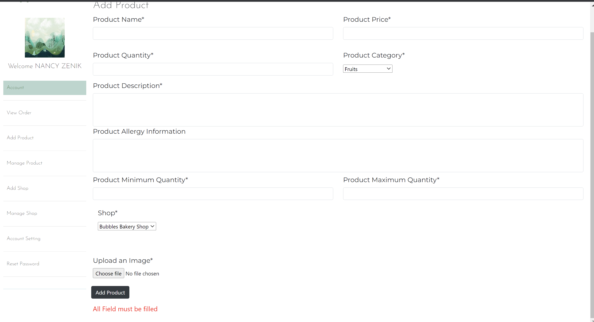</td>
<td>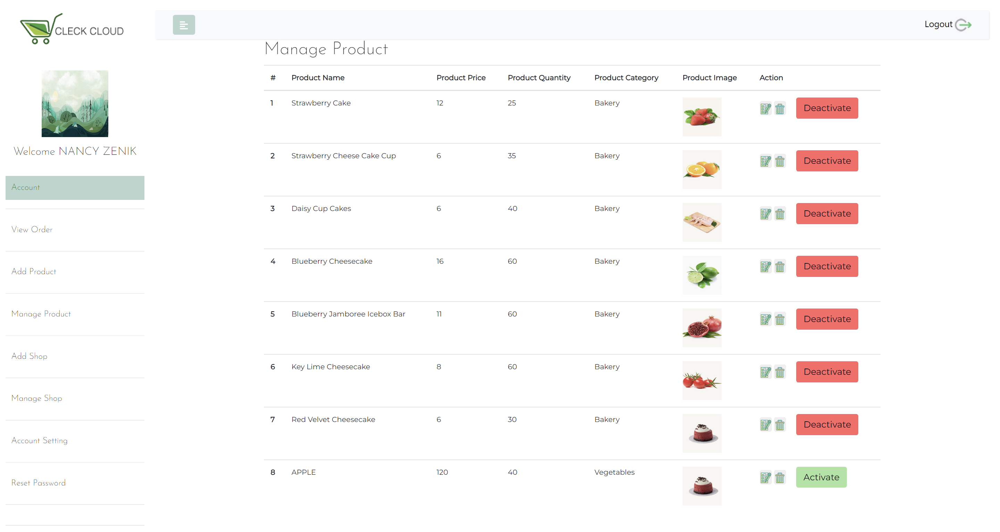</td>
</tr>
</table>

### Product Update

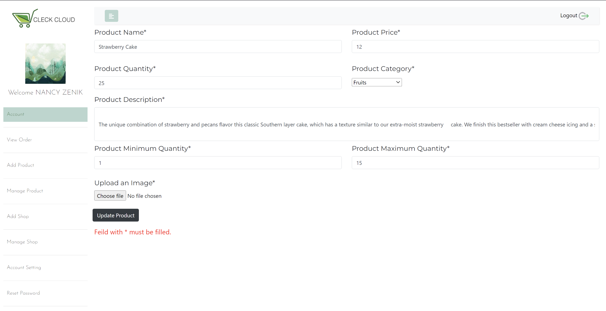

Product management therefore covers the product lifecycle rather than only initial creation.

---

## Shop Management

A trader can operate shops within marketplace rules and approval constraints.

Shop-management features include:

- Add shop
- Required-field validation
- Duplicate-shop-name checking
- Duplicate business-registration-number checking
- Trader shop-count limits
- Administrator approval for additional shops
- View/manage shops
- Update shop
- Delete shop
- Shop activation after approval

<table>
<tr>
<td width="50%" align="center"><strong>Add Shop</strong></td>
<td width="50%" align="center"><strong>Manage Shops</strong></td>
</tr>
<tr>
<td>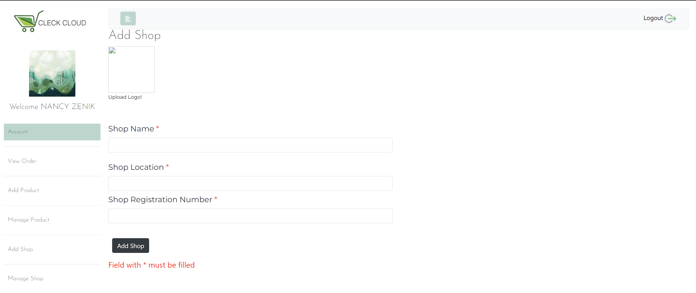</td>
<td>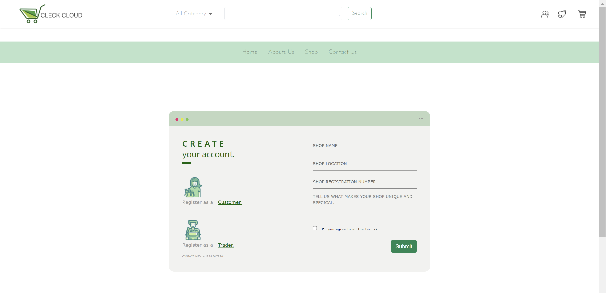</td>
</tr>
</table>

This maintains marketplace governance even after the initial trader account has been approved.

---

## Trader Order Management

Traders can view orders relevant to their marketplace activity.

Order-management information includes:

- Ordered products
- Quantities
- Customer/order information
- Collection information
- Order status
- Fulfilment details

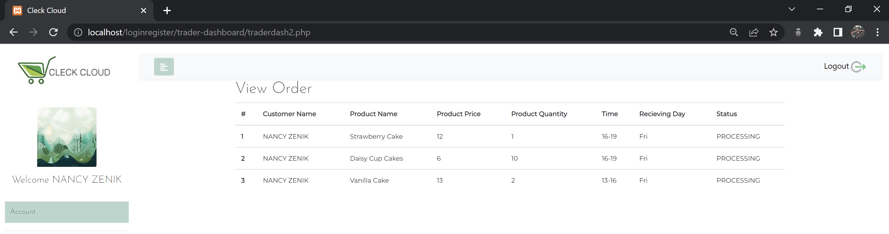

The same order data later feeds into the Oracle APEX reporting and management layers.

---

# 📊 Trader Oracle APEX Portal

Cleck Cloud also includes a separate **Oracle APEX Trader Portal** for analytics, reporting and operational views.

This gives traders a second management surface beyond the PHP dashboard.

## Trader Analytics Dashboard

The trader dashboard provides visual analytics around marketplace activity such as product/order performance and payment-related information.

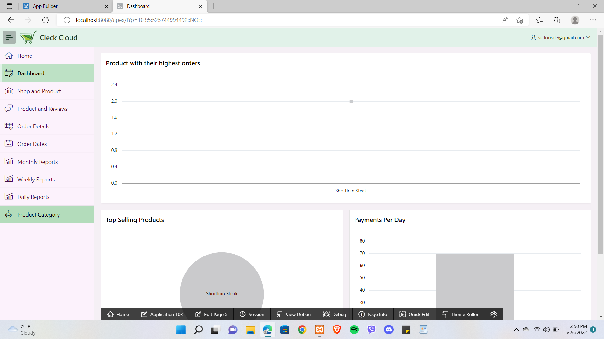

---

## Shop → Product Master-Detail View

Traders can inspect the relationship between their shops and the products belonging to each shop.

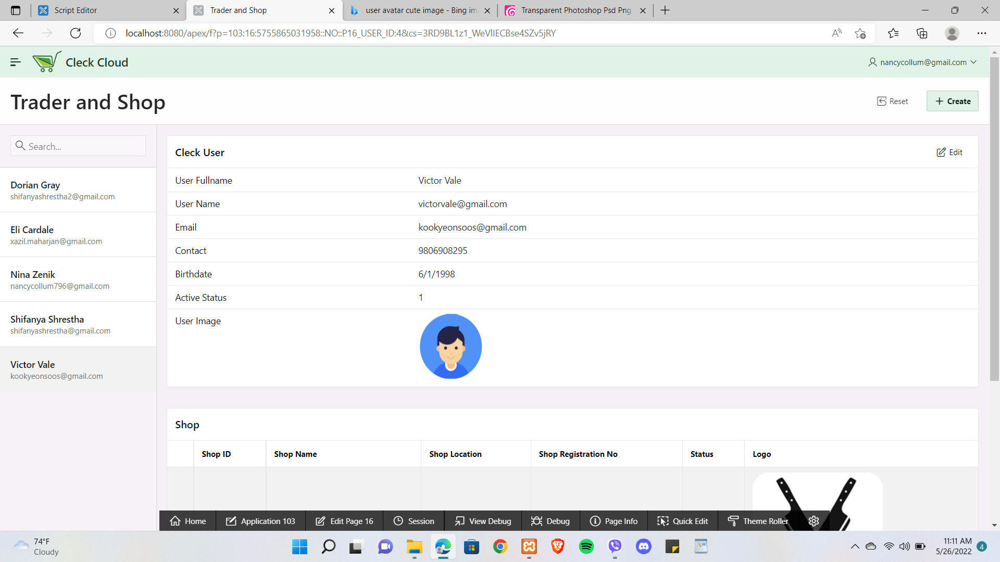

---

## Product → Reviews

The APEX portal also exposes product/review relationships, allowing traders to inspect customer feedback associated with their products.

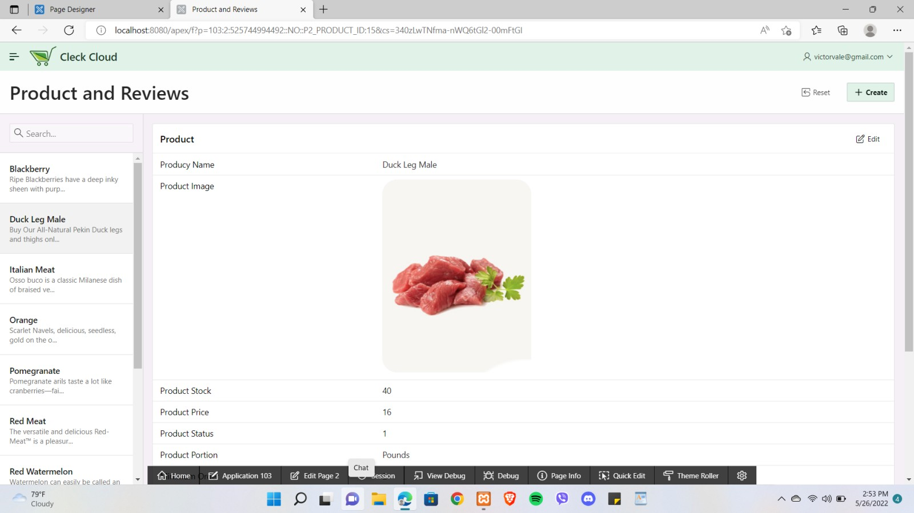

---

## Order Reporting

Operational order information is available through dedicated reports.

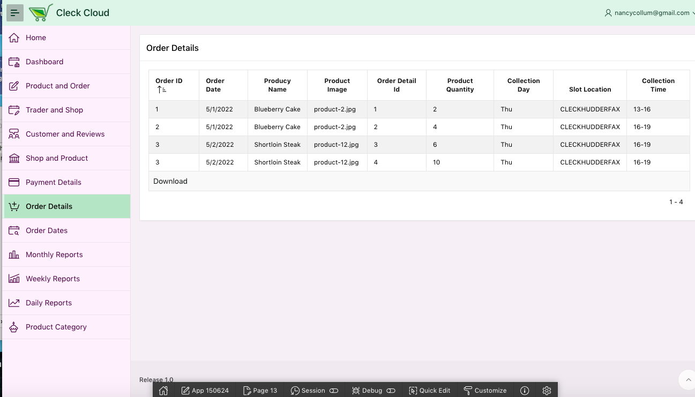

---

## Order Calendar

Orders can also be monitored by date through a calendar-style interface.

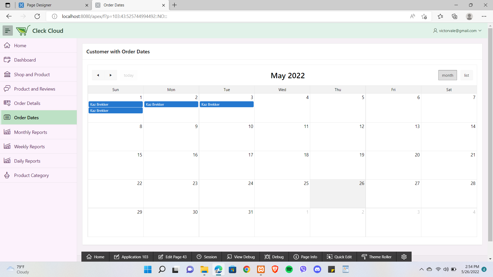

---

## Daily, Weekly & Monthly Reporting

The reporting system supports periodic operational reporting across **daily, weekly and monthly** views.

Reports can include trader/order information, products, collection information and related marketplace data.

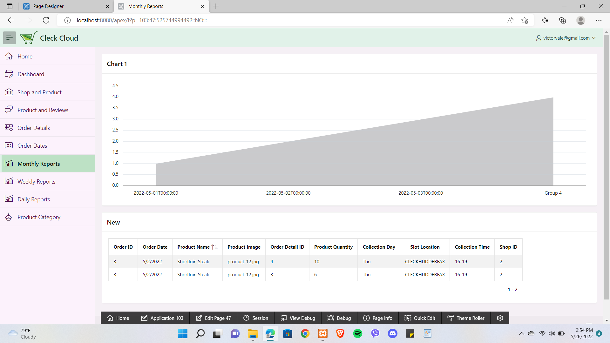

---

# 🛡️ Admin & Management Platform

The Admin application is implemented through **Oracle APEX** and acts as the marketplace-management layer.

Administrators can oversee the relationships and activity spanning customers, traders, shops, products, orders, payments and reviews.

## Admin Dashboard & Analytics

The dashboard provides high-level marketplace information through visualisations and management views.

Analytics include product/order performance and payment-related information.

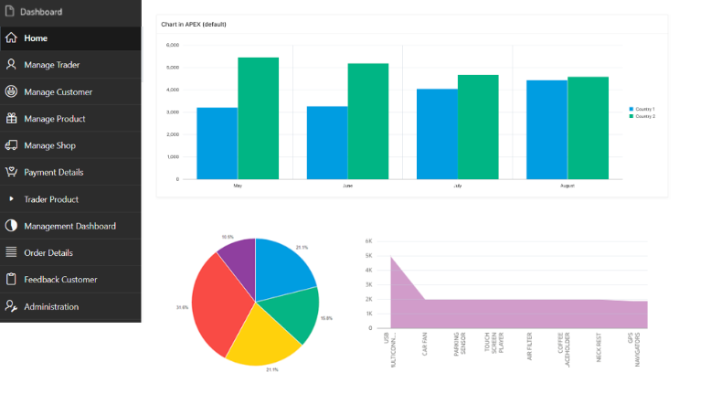

---

## Product → Order Management

Administrators can inspect product records together with their related order information through a master-detail view.

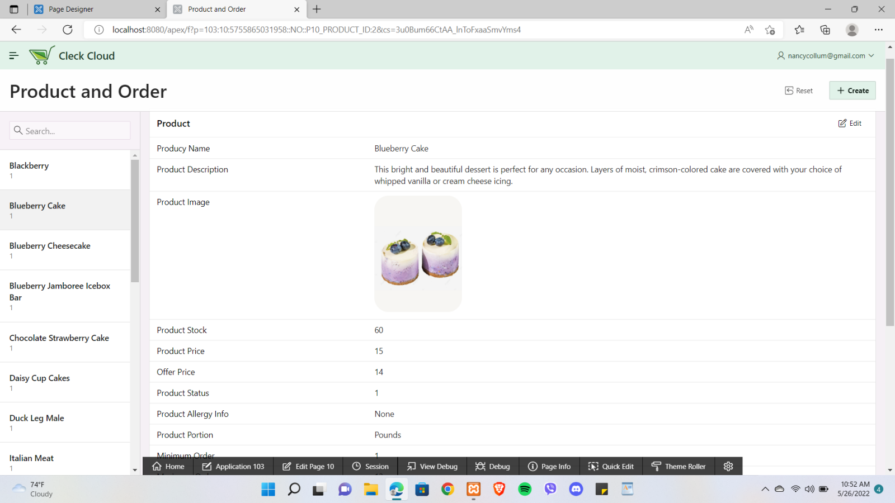

---

## Trader → Shop Management

Trader records can be viewed together with the shops associated with each trader.

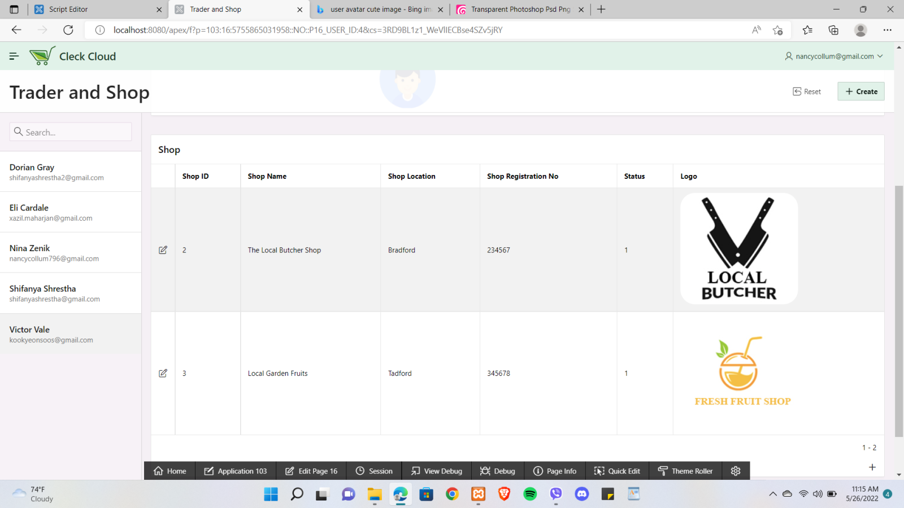

---

## Customer → Review Management

Administrators can inspect customer records alongside review activity.

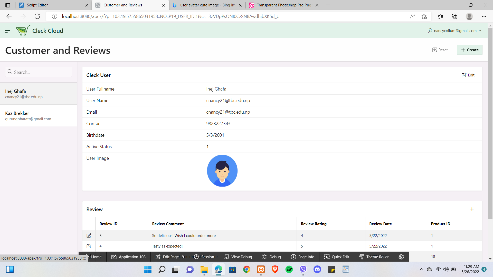

---

## Shop → Product Management

Shop records can be examined together with products belonging to those shops.

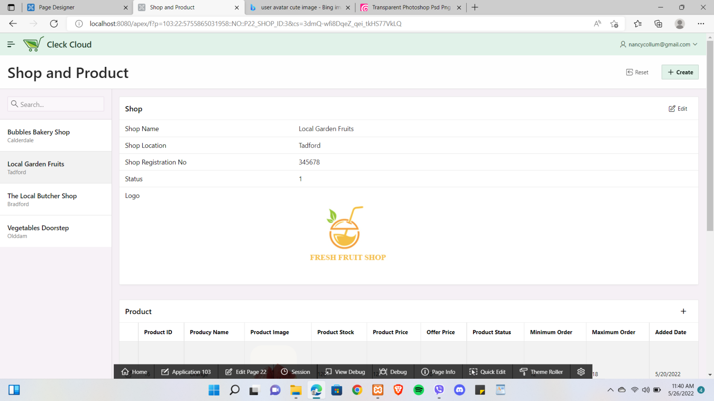

These master-detail views make the underlying relational marketplace structure directly manageable from the administrative interface.

---

## Payment Monitoring

Administrators have access to payment information through dedicated reports.

Payment reporting can include transaction/customer/payment-method information required for marketplace oversight.

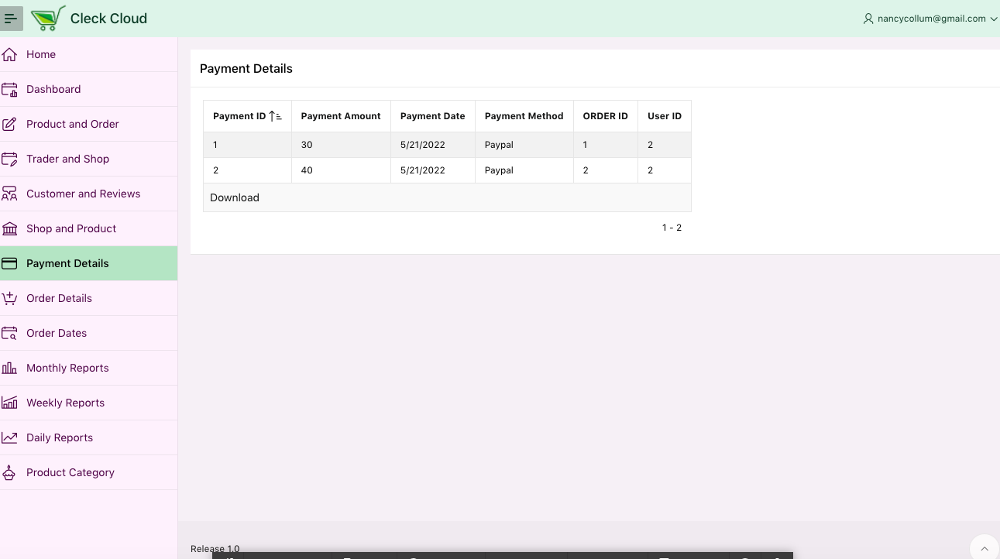

---

## Order Monitoring

Order reports provide administrative visibility into orders, products, customer details and collection/fulfilment information.


---

## Administrative Order Calendar

Orders can also be monitored through a calendar interface.

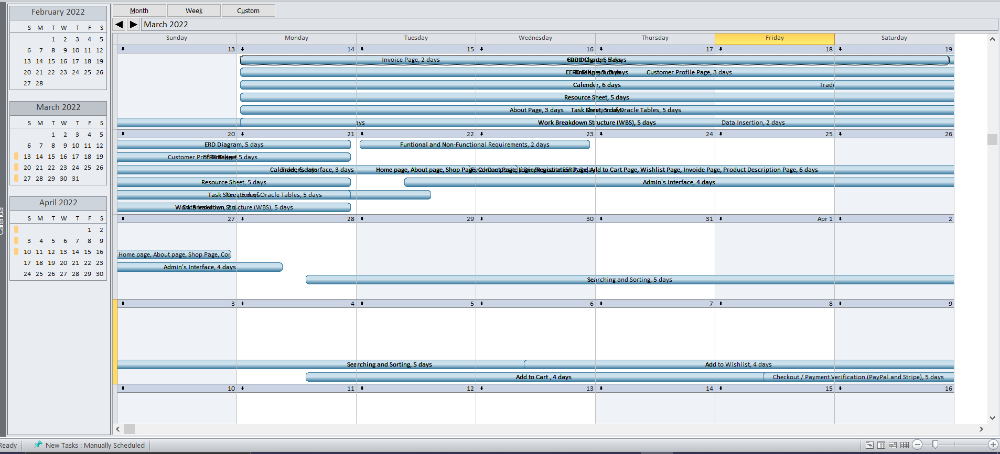

---

## Daily, Weekly & Monthly Management Reporting

The administrative reporting layer supports **daily, weekly and monthly** marketplace reporting.

These reports provide structured operational views across traders, products, orders, collection information and related marketplace data.

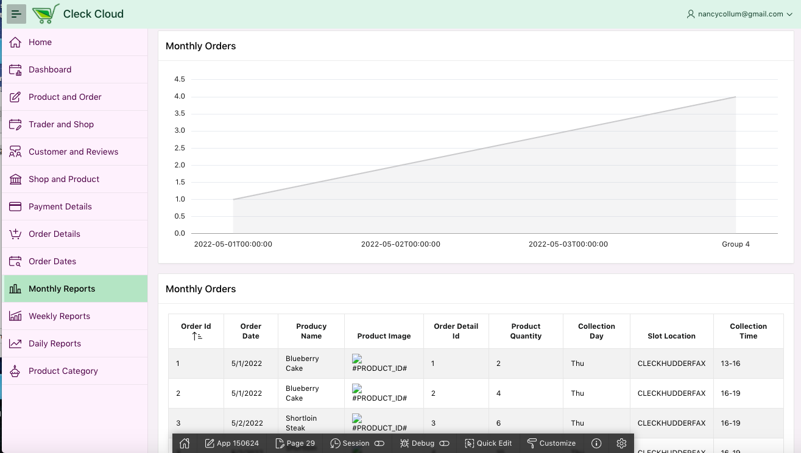

---

# 🔄 End-to-End Commerce Workflow

One of Cleck Cloud's strongest characteristics is that its features do not exist as isolated screens. They participate in one connected marketplace workflow.

```text
CUSTOMER
   │
   ▼
Browse / Search / Filter
   │
   ▼
Product Details & Reviews
   │
   ▼
Wishlist / Shopping Cart
   │
   ▼
Quantity & Stock Validation
   │
   ▼
Checkout
   │
   ▼
Collection Day & Time Slot
   │
   ▼
PayPal Payment
   │
   ▼
Order Creation
   │
   ▼
Invoice Generation / Email
   │
   ▼
────────────────────────────────────
   │
   ▼
TRADER
   │
   ▼
Order Visibility & Fulfilment
   │
   ▼
Operational Reports / Calendar
   │
   ▼
────────────────────────────────────
   │
   ▼
ADMIN
   │
   ▼
Orders / Payments / Traders / Shops
   │
   ▼
Analytics / Reports / Oversight
```

This is what makes Cleck Cloud more than a collection of CRUD pages: the Customer, Trader and Admin platforms operate over the same marketplace lifecycle.

---

# 🏗️ System Architecture

The project uses separate interfaces for each role while sharing the same marketplace data model.

### Role-Oriented System Design

- **Customer PHP application** for shopping and account workflows
- **Trader PHP application** for seller operations
- **Trader Oracle APEX application** for seller analytics and reporting
- **Admin Oracle APEX application** for marketplace management
- **Oracle Database** as the relational data layer
- **PayPal integration** in the customer payment flow

### Overall Use-Case Model

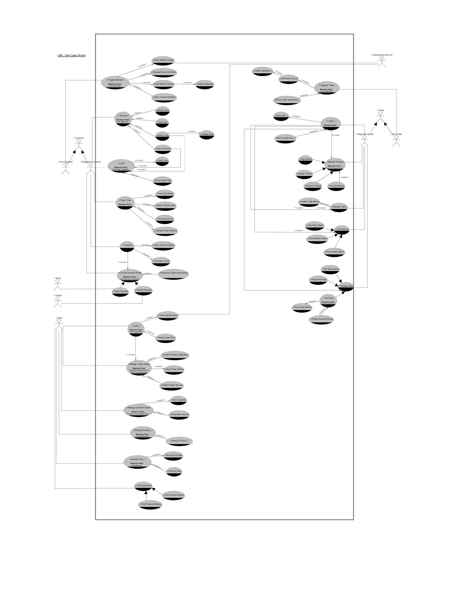

This model reflects the separation of responsibilities between customers, traders and administrators while maintaining a shared marketplace.

---

# 🗄️ Database Design

Cleck Cloud uses an Oracle relational database to model the marketplace.

Major entities include:

| Entity | Responsibility |
|---|---|
| **CLECK_USER** | Customer, trader and administrative user information |
| **SHOP** | Trader-owned shops |
| **PRODUCT_CATEGORY** | Product categorisation |
| **PRODUCT** | Marketplace product records |
| **CART_PRODUCT** | Products associated with customer carts |
| **WISHLIST_PRODUCT** | Customer wishlist records |
| **PROD_ORDER** | Customer orders |
| **ORDER_DETAILS** | Products and quantities belonging to orders |
| **COLLECTION_SLOT** | Collection scheduling |
| **PAYMENT** | Payment records |
| **REVIEW** | Customer product ratings/reviews |
| **DISCOUNT** | Discount-related information |
| **REPORT** | Reporting-related data |

The schema also uses relational database mechanisms including:

- Primary and foreign keys
- One-to-many relationships
- Sequences
- Triggers
- Referential constraints
- Seed/test data

### Entity-Relationship Design

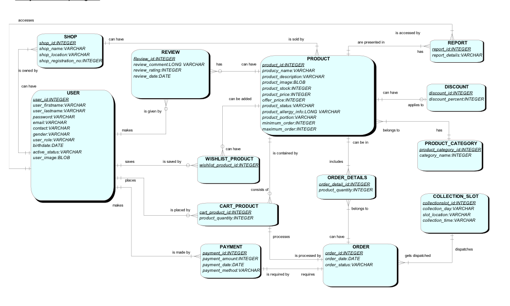

The database design supports the complete lifecycle from users and shops through products, carts, orders, collection slots, payments and reviews.

---

# 🔐 Validation, Access Control & Business Rules

Cleck Cloud contains business rules across all three platforms rather than relying only on basic form submission.

## Customer Rules

Examples include:

- Required-field validation
- Email validation
- Duplicate-email checks
- Password validation
- Account email verification
- Authentication checks
- Review restrictions
- Product stock validation
- Minimum/maximum product quantity
- Overall order quantity constraints
- Profile update validation
- Payment/checkout feedback

## Trader Rules

Trader workflows add further marketplace controls:

- Duplicate trader-email detection
- Duplicate shop-name detection
- Duplicate business-registration-number detection
- Email verification
- Administrator approval
- Pending trader status
- Shop-count constraints
- Product duplication validation
- Product activation/deactivation
- Shop approval requirements

## Role-Based Management

Oracle APEX uses role-oriented access so that trader and administrator management functionality is separated.

The project therefore demonstrates **authentication, verification, approval workflows, access control, validation and domain-specific business rules** across multiple user types.

---

# 🧪 Testing

Testing was performed across each major system surface rather than only the customer interface.

## Customer PHP Testing

Testing covered successful and failure scenarios across:

- Homepage and product discovery
- Search and filtering
- Product details
- Ratings and reviews
- Registration
- Email verification
- Login
- Wishlist
- Cart
- Quantity and stock rules
- Checkout
- Collection scheduling
- PayPal
- Invoice generation
- Contact functionality
- Profile/account management
- Order history
- Password management

## Trader PHP Testing

Trader testing covered:

- Trader registration
- Business validation
- Email verification
- Administrator approval
- Authentication
- Dashboard
- Account/profile management
- Product creation
- Product update
- Product management
- Shop creation
- Shop approval
- Shop management
- Order management
- Password reset/change

## Oracle APEX Testing

Separate testing was carried out for both Trader and Admin APEX applications, including:

- Authentication and authorization
- Dashboards
- Master-detail pages
- Classic reports
- Calendars
- Faceted searches
- Daily/weekly/monthly reporting

The project evidence includes both **successful workflows and validation/error cases**, allowing behaviour to be checked beyond ideal happy-path scenarios.

---

# 🛠️ Technology Stack

| Technology | Role in Cleck Cloud |
|---|---|
| **PHP** | Customer and Trader web applications, business logic and server-side workflows |
| **Oracle Database** | Relational persistence and marketplace data model |
| **Oracle APEX** | Trader analytics/reporting and Admin management applications |
| **SQL / PL/SQL** | Database definition, queries, sequences, triggers and relational operations |
| **HTML5** | Web-page structure |
| **CSS3** | Interface styling |
| **JavaScript** | Client-side interaction |
| **PayPal** | Customer payment workflow |
| **Email Integration** | Verification, approval and invoice/account communication |

### Software-Engineering Concepts Demonstrated

- Full-stack web development
- Multi-role system design
- Multi-vendor marketplace architecture
- Relational database modelling
- Authentication and verification
- Approval workflows
- Role-based access
- Business-rule validation
- Product and inventory management
- Cart and order processing
- Payment integration
- Invoice generation
- Collection-slot scheduling
- Master-detail interfaces
- Reporting and analytics
- System testing and validation

---

# 📁 Project Organisation

The original project package is organised around the major system responsibilities and supporting project artefacts.

```text
Cleck-Cloud/
│
├── Customer Web Application
│   ├── Authentication
│   ├── Product Catalogue
│   ├── Wishlist
│   ├── Cart
│   ├── Checkout
│   ├── Payment
│   └── Account Management
│
├── Trader Web Application
│   ├── Trader Onboarding
│   ├── Dashboard
│   ├── Product Management
│   ├── Shop Management
│   └── Order Management
│
├── Oracle Database
│   ├── Schema
│   ├── Tables
│   ├── Relationships
│   ├── Sequences
│   └── Triggers
│
├── Oracle APEX
│   ├── Trader Application
│   └── Admin Application
│
├── Documentation
│   ├── Requirements
│   ├── User Guides
│   ├── Testing
│   ├── Diagrams
│   └── Project Management
│
└── docs/
    └── screenshots/
```

> The repository contains the original academic implementation and supporting project material. The README focuses on the system's completed functionality and architecture rather than reproducing every project-management artefact.

---

# 📚 Project Context

Cleck Cloud was developed as an **undergraduate software-engineering project** focused on designing and implementing a feature-rich marketplace system.

The implementation was completed by **Avishek Ghimire** and brings together customer-facing e-commerce, trader operations, administrative oversight, relational database engineering, payment processing, reporting and system testing within one project.

The project provided practical experience in:

- Translating a large requirement set into an implemented system
- Designing separate workflows for multiple user roles
- Building end-to-end e-commerce functionality
- Modelling a relational marketplace database
- Connecting web interfaces to Oracle data
- Creating Oracle APEX management applications
- Implementing marketplace business rules
- Integrating external payment functionality
- Testing successful and failure scenarios across multiple platforms

---

# 🚀 Future Improvements

Cleck Cloud represents a complete academic implementation, but a modern production version could be extended further.

Potential improvements include:

- Migrating authentication to modern password-hashing and session-security practices
- Introducing a dedicated REST API/service layer between client applications and the database
- Containerising the application and creating automated deployment pipelines
- Adding automated unit, integration and end-to-end test suites
- Introducing real-time inventory/order notifications
- Expanding payment-provider support
- Adding richer trader analytics and marketplace forecasting
- Modernising the frontend into a responsive component-based UI
- Adding cloud object storage for product/profile images
- Adding audit logging and more granular authorization policies

---

## Final Summary

**Cleck Cloud demonstrates the design and implementation of a complete multi-vendor marketplace rather than a single e-commerce storefront.**

It combines:

**Customer commerce + Trader operations + Oracle APEX analytics + Administrative management + Oracle relational database engineering + PayPal + Invoicing + Collection scheduling + Validation + Reporting + Testing**

into one connected software system.
